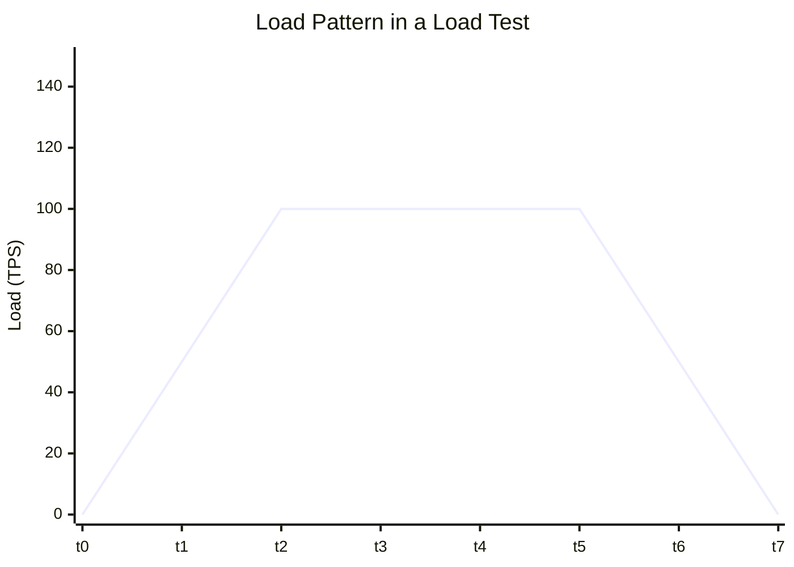
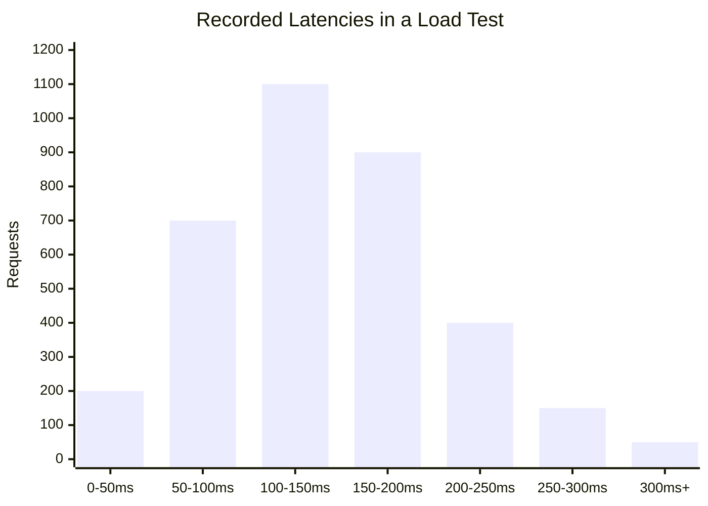
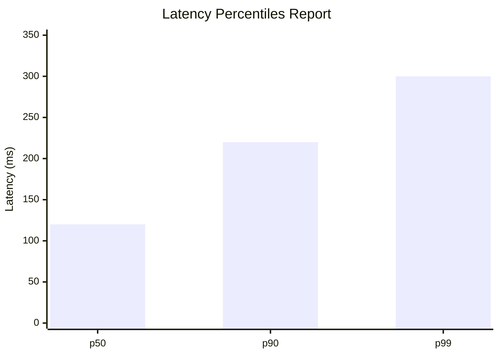
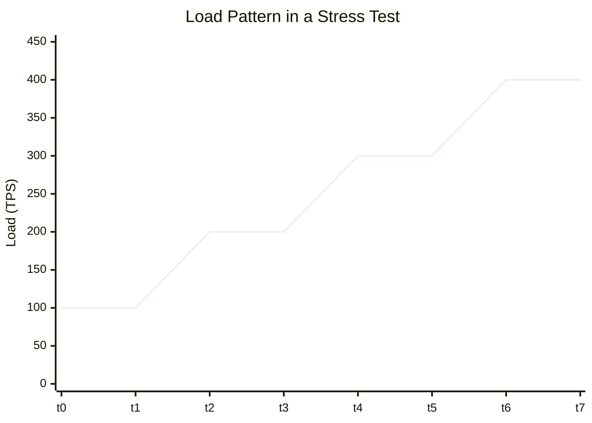
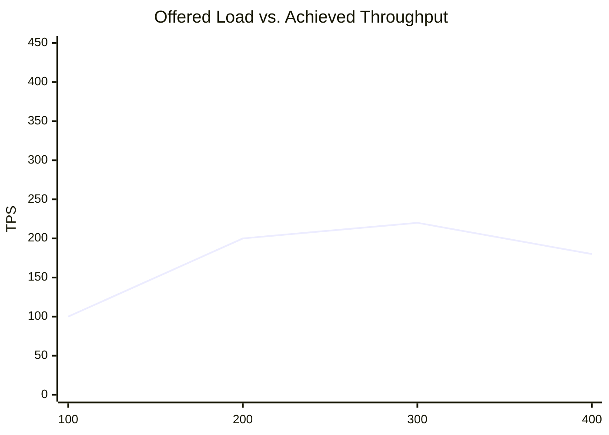
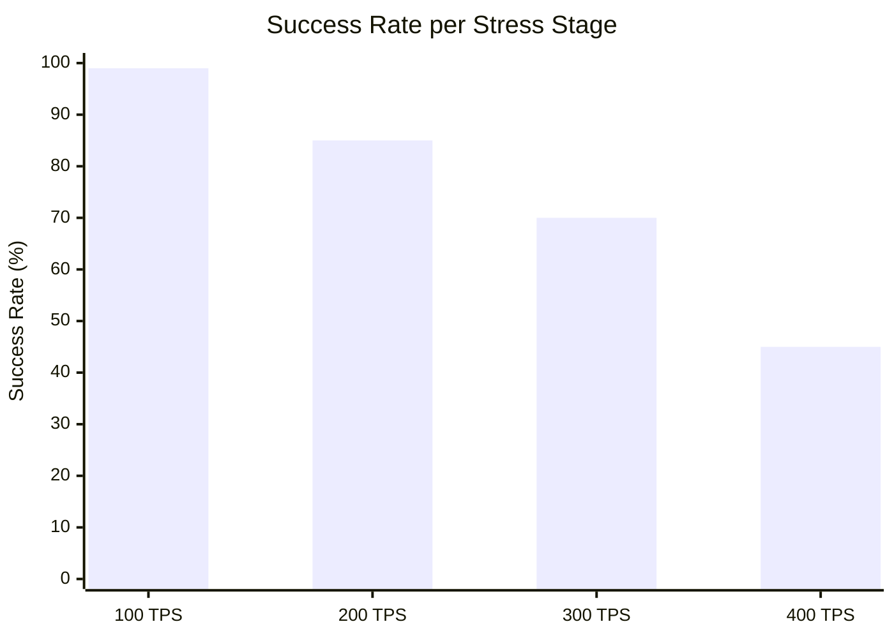
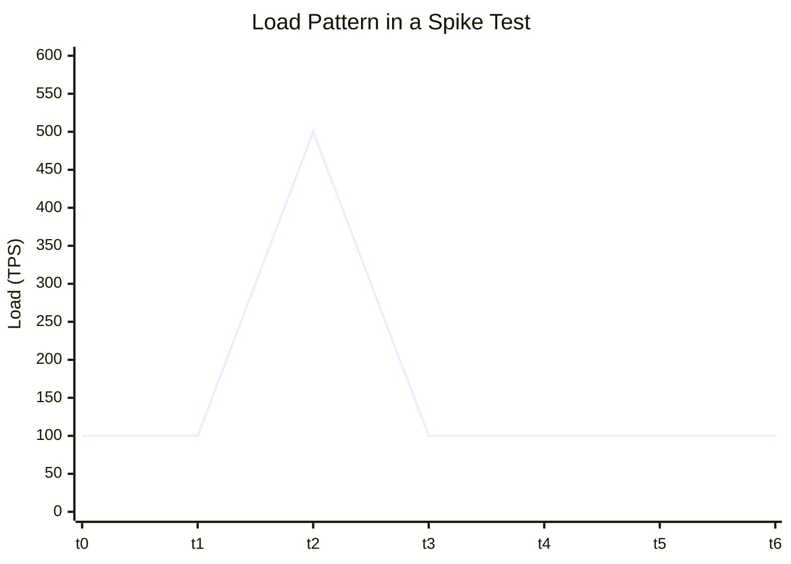
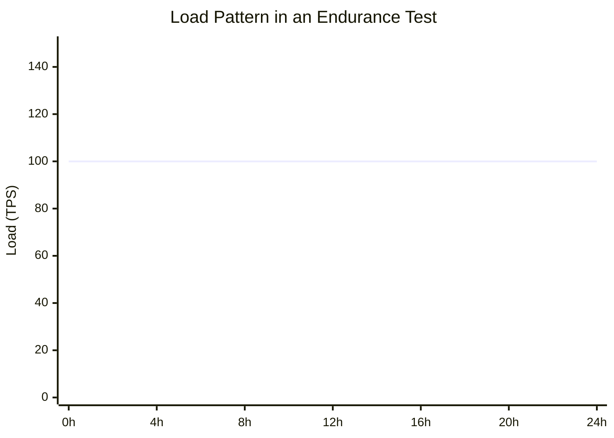
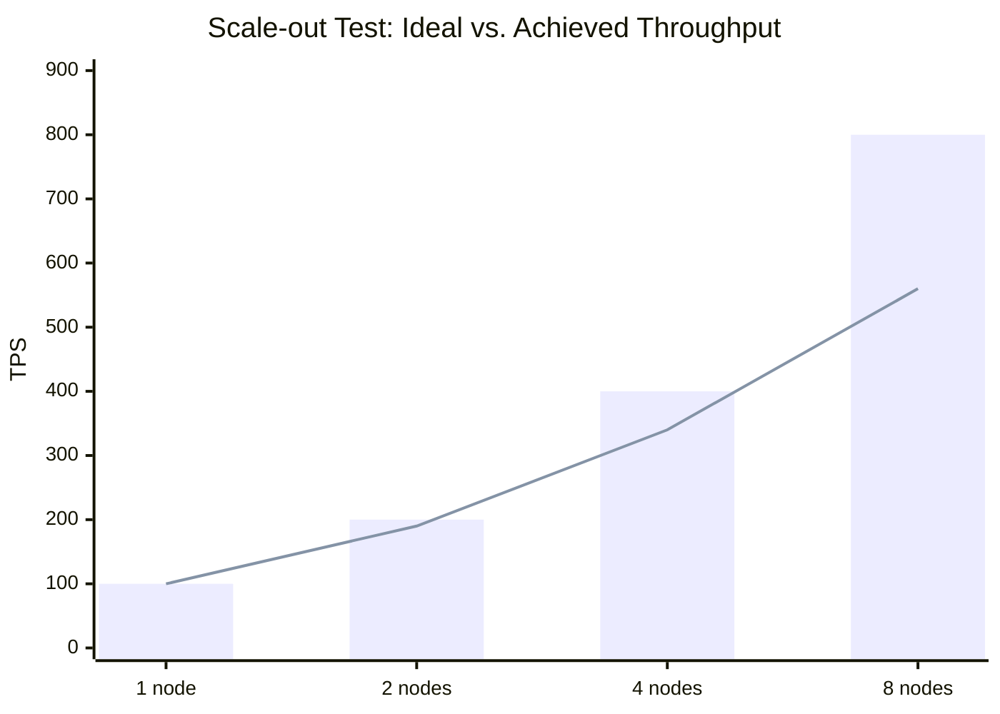

> [!note]- AI Usage Disclosure
> This post was originally written and published on [Medium on Nov 25, 2021](https://medium.com/@kiarashazarnia/types-of-software-performance-testing-35a190af52ed), without any AI. It has since been polished and extended with AI assistance (including the scalability test section), and a few technical mistakes were fixed along the way.

Performance testing is one of the most important and common types of non-functional software testing. As you know, performance is a quality attribute and does not have a well-defined scenario and acceptance criteria like the usual functional requirements — and exactly that is the root of the challenge. So it is critical to have a concise understanding of the different performance testing approaches to design and set up a beneficial performance testing solution.

If you google the topic, you will find some articles with the same title, but I could not find one that was simple and rigorous at the same time, so I decided to write one. Long story short, the conventional types of performance testing are:

- **Load test**
- **Stress test**
- **Spike test**
- **Endurance test**
- **Scalability test**

## What is the designed load?

To dig into the differences, it is important to understand two concepts that are often conflated: **load** and **throughput**.

> **Load** is the demand placed on the system under test (SUT) — for example, the number of concurrent users, or the rate at which requests arrive.

> **Throughput** is the work the system actually completes per unit of time — for example, transactions per second (TPS).

The distinction matters: load is what you *apply*, throughput is what the system *delivers*. When the system is healthy, the two track each other closely. As load approaches and exceeds the system's capacity, throughput saturates and stops rising — but load keeps going up, and the gap shows up as queueing, rising latency, and eventually errors.

The definition of the *service* (the unit of work) depends on the system's functionality:

- **For a transactional banking solution:** the service is the banking transaction, usually requested over HTTP, and the unit of measure will be the number of transactions per second (TPS).
- **For an instant messaging system like Telegram:** the service can be considered as the number of concurrent users holding a persistent connection to the server. Another approach is to focus on the number of messages per unit of time. Different scenarios require different definitions of load.

There is also a useful intuition from queueing theory: latency stays roughly flat while the system is under-utilized, but as utilization approaches saturation, latency grows non-linearly (a consequence of relationships like Little's Law). This is the single behavior that all four test types below are probing from different angles.

So the *designed load* is understandable now:

> The load under which the system should work acceptably, in a well-defined environment — including network, hardware, and operating system configuration — is called the designed load.

## Load test

**Load testing is testing the system's behavior in the normal situation, so that the applied load is under or equal to the designed load.**

If you want to verify the system's performance in the presumed situation, this is the way to go. In load testing, the focus is usually on performance measures like latency or response time.

The load pattern in a load test looks something like the chart below, illustrated for a considered system with a designed load of 100 TPS:

### What does the load test report contain?

As mentioned, a load test is performed under the designed load to focus on the requirements the system is designed to provide in the normal situation. For example, in some performance-critical systems, latency is the key performance indicator. For our considered system, the recorded latencies during the load test look like this:

Service latencies are virtually never normally distributed — they are right-skewed with a long tail, closer to a log-normal shape. We are wary of that tail: it contains the worst user experiences, and it is where degradations first show up. It is also convenient to summarize a load testing report with a few percentile values:

> A percentile is a score below which a given percentage of scores in its frequency distribution falls. For example, the 50th percentile (the median) is the score below which 50% of the scores in the distribution may be found. — Wikipedia

So according to the chart above, we can simply say that the system's 99th latency percentile is 300 milliseconds. Be careful with this kind of summarization though — it can be confusing and distorting for performance testing results. Gil Tene has an awesome talk titled *How NOT to Measure Latency*, calling it the percent-lie! Two ideas from that talk are worth holding onto:

- **Never average latencies.** The mean of a long-tailed distribution hides exactly the tail you care about. Only percentiles of the full distribution are meaningful — and report the maximum too, because even p99.9 can hide a pathological outlier.
- **Beware coordinated omission.** Many load generators subconsciously "wait" for a response before sending the next request (a *closed* system model). When the SUT slows down, the generator slows down with it, and the measured latency distribution looks far better than reality. A correct load generator models an *open* system — requests arrive on a schedule independent of responses — so that slowdowns produce the queueing and back-pressure that real users experience.

## Stress test

**Stress testing is testing the system beyond the designed load.**

The goal of stress testing is assessing the system's performance measures beyond the normal situation. Metrics like the maximum capacity (the saturation point) or the system's crash point can be evaluated with this approach. With a good stress test plan, the development team can enhance the capacity of the system in each iteration based on the results. The load pattern of a stress test for our considered system is illustrated in the next chart:

### What does the stress test report contain?

The most important chart in a stress test plots **offered load against achieved throughput** (goodput). Up to a point, throughput tracks load one-to-one; then it bends — the *knee* — and plateaus. Past the knee, the system is saturated: extra load does not produce extra work, it only produces queueing, retries, and errors. For our considered system, that knee sits around 200 TPS:

Notice how throughput actually *drops* at 400 TPS — the system is now spending more effort on retries, GC pressure, and thrashing than on real work. This collapse past saturation is more informative than the latency numbers, which become meaningless once the system is failing or crashing.

That said, a good stress report must also contain information about the **reliability** of the system at the increasing stages of the generated load. For example, we can evaluate the error rate of the requests as a reliability indicator. Our considered system's stress test result looks like this:

It is beneficial to have a performance acceptance criterion to determine whether the system passes a specific stage of stress or not. Our considered system's acceptance criterion is a success rate of 80% — so it passed the test up to the second stage at 200 TPS, and failed in the following stages.

## Spike test

**A spike test is testing the system's behavior when it is exposed to a sudden spike of load.**

Think of a ticketing system the moment a popular concert goes on sale: the load does not ramp — it explodes, and then disappears almost as quickly.

The interesting question is not only *how the system behaves during the spike* — does it shed load gracefully, or does it fall over? — but also *how it recovers afterward*. A healthy system absorbs the spike (perhaps with degraded latency or throttled requests) and returns to normal within a bounded time. An unhealthy one triggers a cascade: autoscaling that arrives too late, cold caches that stay cold, retry storms from clients that back off in lockstep, or a connection pool that never drains. Always measure the recovery window, not just the spike itself.

## Endurance test

**The endurance test tests the system's behavior under a defined load for a long period of time.**

This is where slow-burning problems show up: memory leaks, connection pool exhaustion, disk fragmentation — issues invisible to a short load test.

The load is flat on purpose — the point is to watch metrics *drift* over time while the input stays constant. Track the things that should be stable: heap and off-heap memory, open file descriptors and database connections, GC pause frequency, and — most importantly — p99 latency creep. A system that holds 100 TPS at 120ms p99 for the first hour but drifts to 250ms by hour twelve has a leak, even if no single request looks catastrophic. The endurance test is what catches it.

## Scalability test

**A scalability test measures how the system's performance changes when its capacity changes — whether adding resources actually buys proportional performance.**

The four test types above vary the *load* against a fixed deployment; the scalability test varies the *deployment* itself. The typical setup is scale-out: apply the same per-node load against 1, 2, 4, and 8 instances of the service and watch how the total achieved throughput grows. The same idea applies to scale-up: double the CPU and memory of a single node and measure again.

The reference is *linear scaling*: if one node serves the designed load of 100 TPS, two nodes should serve 200 TPS, four nodes 400 TPS. Reality always falls short — every system has a serial fraction (a shared database, a single leader, lock contention) and a coordination cost (cache coherence, consensus, load balancing) that grows with the number of nodes. Two classic laws describe exactly this:

- **Amdahl's Law** bounds the speedup by the serial fraction of the workload: if 5% of the work cannot be parallelized, no amount of hardware takes you past a 20× speedup.
- **The Universal Scalability Law** (Neil Gunther) goes further and adds a *coherency* penalty term, which is why the throughput of many real systems not only flattens but actually *degrades* past a certain scale.

So the scalability test report plots achieved throughput against capacity, next to the ideal linear line. For our considered system:

The bars are ideal linear scaling; the line is what the system actually achieves. Reading the gap as *scaling efficiency* — achieved divided by ideal — gives 100%, 95%, 85%, and 70% at each step: every doubling of capacity buys less than the previous one. That curve is the real deliverable of the test. It tells you where scaling stops being cost-effective, and it points at the bottleneck to remove next — in this system, something shared starts to dominate beyond four nodes, and capacity money is better spent there than on more instances.

## Conclusion

It is challenging to recognize and represent the system's performance requirements, especially while the test plan totally depends on them. But if you are involved in developing performance-critical software, do not hesitate to set up a performance testing solution. Although there are lots of tools, frameworks, and technical details, it is always inspiring to start with a sketch test plan and a simple tool like k6. Then criticize your solution and debate it with your teammates — you will end up with a powerful and valuable solution by the magic of continuous improvement.

One last caveat: a test is only as honest as its environment. Results from an empty database, cold caches, or stubbed-out downstream dependencies are fiction. Aim for production-like data volumes and a realistic dependency graph, or your numbers — however precise — will not predict reality.

## Final note

There are more performance testing types — micro-benchmarking, volume testing, capacity testing, and so on — of which some are outside the scope of this article, which focuses on the most common types, and some are other representations of the ones explained here. Peak testing, for instance, is another name for spike testing. The terminology in this field is inconsistent, partly because it grew up inside engineering teams rather than from a single academic tradition — so expect to see the same idea under different names, and don't let the naming distract you from the underlying behavior being probed.

## References and beneficial links

This is not an academic article, so excuse me for not respecting conventional referencing formats. Here are some links I have used and found informative:

- Gil Tene's talk: *How NOT to Measure Latency*
- A good book: *The Art of Application Performance Testing*
- *Guerrilla Capacity Planning* by Neil Gunther: the Universal Scalability Law and capacity planning in depth
- *Systems Performance* by Brendan Gregg: includes a clear treatment of Amdahl's Law and the Universal Scalability Law
- [k6](https://k6.io): a performance testing tool
- [HdrHistogram](https://github.com/HdrHistogram/HdrHistogram): high-resolution latency recording
- *Test Automation in DevOps*: an informative course
- *A Survey on Load Testing of Large-Scale Software Systems*
